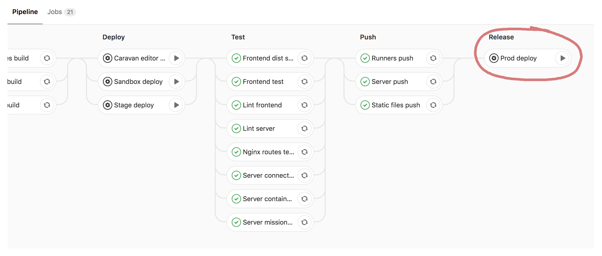

# DevOps cheatsheet

This document is a brain dump of all the things that might be useful when DevOps is Unavailable. It contains various instructions for deployments, Kubernetes, Logging and the likes, and has links to further information and documentation. If you notice any issues or missing information please log it in Twist, in the `#Devops` channel - you’re also welcome to make changes to or contribute to this document.

## Getting setup

### Google Cloud and Kubernetes Engine

To work with Google Cloud you will need to install the [Google Cloud SDK](https://cloud.google.com/sdk/downloads).

Once you have installed the SDK I recommend you use the Cloud SDK managed kubectl:

```shell
gcloud components install kubectl
```

### Additional gcloud components

Some additional components that are useful when working with Cloud:

* `docker-credential-gcr` - allows you to use Google Container Registry with the Docker CLI.
* `container-builder-locally` - allows testing build manifests locally.
* `gsutil` - is the Cloud Storage CLI.
* `pubsub-emulator` - allows for testing Pub/Sub code locally.
* `beta` - installs gcloud beta commands.

These are installed via `gcloud components install [components]`

For the most part, only kubectl will be required, but the other tools may be useful for working with other parts of our stack and Cloud environment.

### Optional tools

The following tools are useful, depending on what you will be working with:

* [kubectx](https://github.com/ahmetb/kubectx) - tool for working with Kubernetes contexts and namespaces.
* [ZSH Kubernetes prompt](https://github.com/superbrothers/zsh-kubectl-prompt) - displays the current kuerbetes
  context and namespace in the ZSH prompt.
* [Firebase tools](https://github.com/firebase/firebase-tools) - tools for working with Firebase.
* [Cloud Functions emulator](https://github.com/GoogleCloudPlatform/cloud-functions-emulator) - tool for emulating
  Cloud Functions locally.
* [jq](https://stedolan.github.io/jq/) - command-line JSON processor.

### Authentication

Before you can start working with the Cloud tools you will need to authenticate with Cloud and fetch Kubernetes config:

```shell
gcloud auth login
gcloud container clusters get-credentials dataquest -z us-east-1b 
```

You’ll now be able to work with gcloud and kubectl with the `dataquest` cluster - where our main stack is installed.

If you need to work with additional clusters just replace `dataquest` in the `get-credentials` command with `<cluster name>` (you may need to change the zone as well). You can get a list of available clusters and their zones by running:

```shell
gcloud container clusters list
```

Check that everything is working by running:

```shell
kubectl get pods -n prod
```

This should print all the pods running in the `prod` namespace.

## Deployments

Deployments are run via a manual step, called “Prod deploy”, in the Gitlab pipeline.



In the event that this fails you will need to run and manage the deploy via the Kubernetes templates in the Deploy repo. This manual process hasn’t changed since the move to Cloud - you just change the image tags to the latest master commit hash.

The only difference is that the `dscontent` image tag is set to `latest` so all deploys get the latest content, so no need to change this.

### Deployment process

* Get together a list of all the MRs that are ready for deployment - note only those with the `approved` label and have at least 2 approvals and have passed their pipelines are available for deploy.
* Create a twist topic for the deploy in `#Devops` channel. For example; `Deploy May 15` .
* The body  of the topic should list all the MRs going into the release, plus any other notes (such as “frontend only”, “has DB changes”):

```text
**Going into this release**
* !378 Feature/502 success url.
* !376 Bug/413 course 500.
* !375 Feature/319 user story.
* !382 Added may Promo discount code.
```

* Next up is to merge all those MRs into master.
* Once the most recent master pipeline has passed you are ready for deploy.
* Announce in the Twist thread that you are now deploying.
* Click the “Prod deploy” play button in the Gitlab pipeline screen.
* Once the job has completed you’ll need to watch the status of the deploy via `kubectl get pods -n prod`.
* Once `mainstack-frontend` pod has started and is ready you’ll need to:
  * First announce you are doing so in the Twist thread.
  * Click the “Purge Everything” button in the [CloudFlare Caching page](https://www.cloudflare.com/a/aacc167fc77d9083726a326e1312c0ef/dataquest.io/caching) .
* Now, just wait for all the pods to start `kubectl get pods -n prod`.

## Kubernetes Engine

* [Clusters](https://console.cloud.google.com/kubernetes/list?project=dataquest-flower)
* [Deployments, Jobs, Stateful Sets, Replication Controllers, etc](https://console.cloud.google.com/kubernetes/workload?project=dataquest-flower)
* [Services and Ingresses](https://console.cloud.google.com/kubernetes/discovery?project=dataquest-flower)

I won’t go into detail about Kubernetes itself as if you’re not familiar with it you don’t want to be here.

## Logging and metrics

* [Stackdriver Logging home](https://console.cloud.google.com/logs/viewer?project=dataquest-flower)
  * [GKE dataquest prod](https://console.cloud.google.com/logs/viewer?project=dataquest-flower&resource=container%2Fcluster_name%2Fdataquest%2Fnamespace_id%2Fprod)
  * [GKE dataquest stage](https://console.cloud.google.com/logs/viewer?project=dataquest-flower&resource=container%2Fcluster_name%2Fdataquest%2Fnamespace_id%2Fprod)
  * [Gitlab](https://console.cloud.google.com/logs/viewer?project=dataquest-flower&resource=gce_instance%2Finstance_id%2F2774885257275351010)
* [Stackdriver Monitoring home](https://app.google.stackdriver.com/?project=dataquest-flower)
  * [Key metrics dashboard](https://app.google.stackdriver.com/monitoring/1068098/key-metrics?project=dataquest-flower)
  * [Uptime checks](https://app.google.stackdriver.com/uptime?project=dataquest-flower)
  * [Alerting policies](https://app.google.stackdriver.com/policy-advanced?project=dataquest-flower) (AKA alarms)

### Logs

[This page](https://cloud.google.com/logging/docs/view/overview) gives a good overview of working with the logs. You can also [see here](https://cloud.google.com/logging/docs/view/advanced-filters) for more advanced searches.

### Metrics

Generally the [Key metrics dashboard](https://app.google.stackdriver.com/monitoring/1068098/key-metrics?project=dataquest-flower) will give enough info to tell you the site is having problems or code running is failing. These are similar to DataDog metrics.

I won’t go into detail about working with metrics queries and log 
metrics as these are a little involved and fiddly. Hopefully, you won’t need to, anyway.

## Google Cloud SQL

To use Google Cloud SQL you will need to use the Cloud SQL Proxy tool. This uses a service account key to proxy requests from localhost. You can whitelist IP addresses in Cloud SQL, but this is the easiest way and how our services connect.
 
### Installation

Follow the [instructions here](https://cloud.google.com/sql/docs/postgres/connect-admin-proxy) to install the client and connect to the Database. Tip: move `cloud_sql_proxy` to `/usr/local/bin/`.

If you want to connect to the prod database, for example, you can get the  instance connection name from the [Cloud SQL Console](https://console.cloud.google.com/sql/instances/dataquest-prod/overview?project=dataquest-flower) or running

```shell
gcloud sql instances list --format json | jq -r '.[].connectionName'
```

### Example: connecting to prod

You will first need to export an environment variable.

```shell
cloud_sql_proxy -instances=dataquest-flower:us-east1:dataquest-prod==tcp:3306 &
```

Wait for the shell to print `Ready for new connections`, then

```text
psql -h 127.0.0.1 -p 3306 -U posqgres dsserverprod
```

You’ll need to get the password from the deploy repo. This can be found in `cluster/secrets/misc.yaml` under `cloud-sql.dataquest-prod.users.postgres`. You can also use the same connection information the backend uses.

## Keys and passwords

### Cloud service account keys

To access parts of Google Cloud you will need to use a service account. These can be found in the deploy repo. Currently there are only 2; Cloud SQL and Compute Engine.

#### Cloud SQL

`cluster/secrets/service-accounts.yaml`

This file is a Kubernetes Secret type file. As such, each key is base64 encoded. To use the key you will first need to decode it:

```shell
echo “<encoded key value>” | base64 —decode
```

#### Compute Engine

`cluster/secrets/service-accounts/compute-engine.yaml`

This is just a raw JSON file so can be used as-is.

## Cloud users and accounts (IAM)

TBC

## GItlab and runners

Gitlab and it’s runners are installed in a single Cloud Compute instances called `gitlab`.

To access this instance you can use the `gcloud` CLI:

```shell
gcloud compute ssh gitlab
```

This will SSH you into the machine with an account in your name. You can use root without a password - `sudo -s` will give you a root shell.

To get the status of Gitlab services run `gitlab-ctl status` as root.

If you’re experiences problems with Gitlab, not the runners, it may the simplest to just restart Gitlab with `gitlab-ctl restart`.

### Updating Gitlab configuration

The Gitlab config can be found in the deploy repo at `apps/gitlab/gitlab/secrets/gitlab.rb`. Make your changes here then:

* SSH into the Gitlab instance and enter a root shell.
* `vim /etc/gitlab/gitlab.rb`
* Copy the contents of the `gitlab.rb` file into the clipboard.
* Run the following vim sequence `:ggVGpwq!`
* This will override the contents of the file with the contents of the clipboard and save and close Vim.
* Now update Gitlab’s config with `gitlab-ctl reconfigure`.
* Wait a  short while and Gitlab should have updated it’s config and restarted the required services.

### Gitlab runners

For now, I’ll only cover what to do if the runners start misbehaving.

The quick and dirty resolution is to kill the runners. You'll need to SSH into the Gitlab machine to delete references to the runners, this will force creating on new ones.

Get the list of machines for cleanup:

```shell
MACHINES=$(gcloud compute instances list --format json | jq '.[]."name" | select(contains("gitlab-test-runner"))' | tr '"' '' | tr '\r\n' ' ')
```

Delete the instance references from the Gitlab machine:

```shell
gcloud compute ssh gitlab
sudo -s
rm -rf /root/.docker/machine/machines/*
exit
```

Delete the actual instances:

```shell
gcloud compute instances delete $MACHINES
```

## Redis

Redis is now deployed in Kubernetes alongside the other mainstack services. To connect to the Redis instance log into one of the pods and run the redis-cli command:

```shell
kubectl get pods -n <namespace> | grep redis
kubectl exec -it <pod id> redis-cli
```